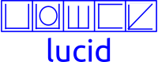

# 💠 Project Lucid: The Isometric Urdu Orthography

**Project Lucid** is a structural modernization of the Urdu writing system. It introduces an atomic, monospaced, and non-joining neography designed specifically for the digital age.

By bypassing the computational "shaping" requirements of traditional Nastaliq, Lucid allows for phonetic Urdu typing on any standard QWERTY keyboard with zero additional software installation, utilizing a rigorous **25mm x 25mm isometric grid**.



---

## 👁️ The Vision

Traditional Urdu (Nastaliq) is a masterpiece of calligraphy but a challenge for digital engineering. **Lucid** offers a "Third Way"—preserving the phonetic soul and Right-to-Left (RTL) flow of Urdu while adopting the ergonomic efficiency of monospaced Latin scripts. Right now RTL is not working, especially when using PUA, maybe we need to assisgn this to Arabic/Urdu code block later. 

* **One Sound, One Glyph:** No initial, medial, or final forms.
* **Monospaced Geometry:** Every character is a perfect square.
* **Searchable Data:** Internally stored as standard phonetic Latin; externally displayed as Lucid glyphs.
* **Zero-Setup:** Works in any RTL-aware environment (Word, Browsers, IDEs) via OpenType substitution.

---

## 🛠️ Technical Specifications

### 1. The 25mm Standard

Every glyph in this repository is designed within a **25mm x 25mm master square**.

* **Units Per Em (UPM):** 1000
* **Advance Width:** 1000 (Strict Monospace)
* **Source Assets:** 39 high-fidelity vector glyphs.

### 2. The Phonetic Engine

Project Lucid utilizes the **OpenType `calt` (Contextual Alternates)** feature to map standard QWERTY input to the 39-glyph inventory.

| Input | Glyph PUA | Phoneme | Logic |
| --- | --- | --- | --- |
| `a` | `U+E016` | ا | Short Vowel |
| `b` | `U+E000` | ب | Labial Plosive |
| `p` | `U+E001` | پ | Aspirated Plosive |
| `t` | `U+E002` | ت | Dental |
| `T` | `U+E003` | ٹ | Retroflex |
| `d` | `U+E005` | د | Dental |
| `D` | `U+E006` | ڈ | Retroflex |
| `r` | `U+E007` | ر | Tap |
| `R` | `U+E008` | ڑ | Retroflex Flap |
| `j` | `U+E009` | ج | Affricate |
| `c` | `U+E00A` | چ | Affricate |
| `k` | `U+E00B` | ک | Velar |
| `g` | `U+E00C` | گ | Velar |
| `f` | `U+E00D` | ف | Labiodental |
| `q` | `U+E00E` | ق | Uvular |
| `s` | `U+E00F` | س | Sibilant |
| `S` | `U+E010` | ص | Sibilant |
| `C` | `U+E011` | ث | Sibilant |
| `z` | `U+E012` | ز | Fricative |
| `Z` | `U+E013` | ذ | Fricative |
| `J` | `U+E014` | ض | Fricative |
| `V` | `U+E015` | ظ | Fricative |
| `x` | `U+E016` | ش | Sibilant |
| `h` | `U+E018` | ح | Aspirate |
| `o` | `U+E017` | ہ | Aspirate |
| `G` | `U+E019` | غ | Fricative |
| `K` | `U+E01A` | خ | Fricative |
| `m` | `U+E01B` | م | Nasal |
| `n` | `U+E01C` | ن | Nasal |
| `X` | `U+E01D` | ژ | Persian |
| `a` | `U+E01E` | ا | Vowel (Alif) |
| `A` | `U+E01F` | آ | Vowel (Long Alif) |
| `i` | `U+E020` | ی | High Vowel (Ye) |
| `y` | `U+E021` | ے | Mid Vowel (Bari Ye) |
| `w` | `U+E022` | و | Vowel (Wao) |
| `e` | `U+E025` | ع | Vowel (Ain) |
| `u` | `U+E026` | ء | Glottal Stop |
| `N` | `U+E027` | ں | Nasal |
| `l` | `U+E028` | ل | Lāmd |

---

## 📂 Repository Structure

```text
├── assets/             # Original 25mm SVG Master Sheet
├── build/              # Compiled .OTF and .TTF files
├── source/             # FontForge (.sfd) project files
├── docs/               # The Lucid Manifesto (Full Documentation)
├── OFL.txt             # SIL Open Font License 1.1
├── README.md           # Project Overview & Documentation
└── CONTRIBUTING.md     # Guidelines for Contributors

```

---

## ⬇️ Download the font

First build of Lucid Urdu Font (.OTF) can be [dowloaded from here](build/LucidUrdu.otf). 


## 🚀 How to Use

1. **Install** the `LucidUrdu.otf` font.
2. **Open** any text editor (MS Word, VS Code, Browser).
3. **Select** the "Lucid Urdu" font.
4. **Enable** Right-to-Left (RTL) paragraph direction.
5. **Type** phonetically (e.g., typing `p a k i s t a n` renders the Lucid isometric symbols).

---

## ⚖️ License

This project is licensed under the **[SIL Open Font License 1.1](OFL.txt)**. You are free to use, study, modify, and redistribute the font, provided you do not sell the font by itself.

Derived from the original 37-glyph research at [font.shehroz.pk](https://font.shehroz.pk/) and the [Shehroz Font Project](https://github.com/xehroz/Shehroz-Font).

---

## 🤝 Contributing

We welcome developers, linguists, and designers to [contribute](/CONTRIBUTING.md) to the **Lucid Manifesto**.

1. Fork the repo. BTW everything belonging to this project is available on [GitHub](https://github.com/xehroz/lucid)
2. Propose changes to the `calt` mapping or glyph geometry.
3. Submit a Pull Request.

---

**Project Lead:** Shehroz Kaleem

**Documentation:** Master documentation is available [here](/docs/project-lucid-master-document.pdf). 

**"Simplicity is the ultimate sophistication."** 

---
